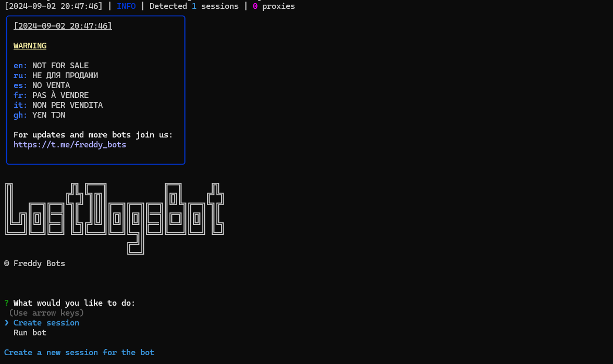

> [](https://t.me/roddyfred)



# Use Node.Js 18 or greater

## Functionality

| Functional                                                    | Supported |
| ------------------------------------------------------------- | :-------: |
| Choosing cards                                                |    ✅     |
| Claim tasks rewars                                            |    ✅     |
| Multithreading                                                |    ✅     |
| Binding a proxy to a session                                  |    ✅     |
| Auto-purchase of items if you have coins (multitap, attempts) |    ✅     |
| Use sessions/query_ids                                        |    ✅     |
| Binding a proxy to a session/query_id                         |    ✅     |

## [How to add query id](https://github.com/Freddywhest/RockyRabbitBot/blob/main/AddQueryId.md)

## [Settings](https://github.com/FreddyWhest/LostDogsBot/blob/main/.env-example)

| Settings                   | Description                                                                                                            |
| -------------------------- | ---------------------------------------------------------------------------------------------------------------------- |
| **API_ID / API_HASH**      | Platform data from which to launch a Telegram session (stock - Android)                                                |
| **CHOOSE_RANDOM_CARDS**    | Whether the bot choose random cards (True / False)                                                                     |
| **CARD_TO_CHOOSE**         | Which card the bot should choose (must be 1-3). Make sure you set `CHOOSE_RANDOM_CARDS` to `False` before you set this |
| **AUTO_CLAIM_TASKS**       | Whether the bot claim tasks (True / False)                                                                             |
| **SLEEP_BETWEEN_REQUESTS** | Delay between requests in seconds (eg. 70)                                                                             |
| **USE_PROXY_FROM_FILE**    | Whether to use proxy from the `bot/config/proxies.js` file (True / False)                                              |
| **USE_QUERY_ID**           | Whether to use query ids instead of sessions (True / False)                                                            |

## Installation

You can download [**Repository**](https://github.com/FreddyWhest/LostDogsBot) by cloning it to your system and installing the necessary dependencies:

```shell
~ >>> git clone https://github.com/FreddyWhest/LostDogsBot.git
~ >>> cd LostDogsBot

#Linux and MocOS
~/LostDogsBot >>> chmod +x check_node.sh
~/LostDogsBot >>> ./check_node.sh

OR

~/LostDogsBot >>> npm install
~/LostDogsBot >>> cp .env-example .env
~/LostDogsBot >>> nano .env # Here you must specify your API_ID and API_HASH , the rest is taken by default
~/LostDogsBot >>> node index.js

#Windows
1. Double click on INSTALL.bat in LostDogsBot directory to install the dependencies
2. Double click on START.bat in LostDogsBot directory to start the bot

OR

~/LostDogsBot >>> npm install
~/LostDogsBot >>> cp .env-example .env
~/LostDogsBot >>> # Specify your API_ID and API_HASH, the rest is taken by default
~/LostDogsBot >>> node index.js
```

Also for quick launch you can use arguments, for example:

```shell
~/LostDogsBot >>> node index.js --action=1

OR

~/LostDogsBot >>> node index.js --action=2

#1 - Create session
#2 - Run clicker
```
